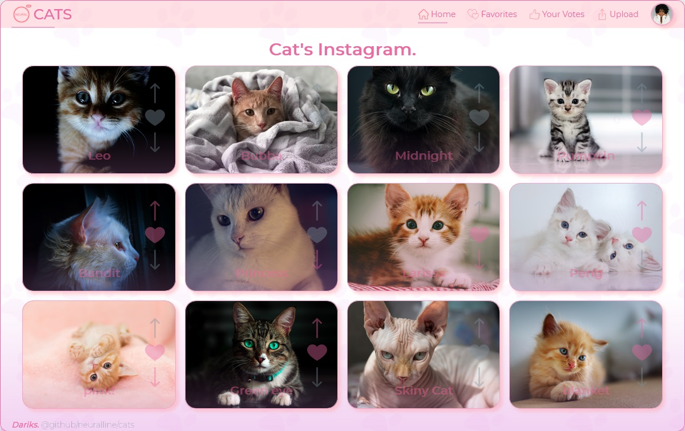

# CATS.

## cats-aws-app

It's all about cats... you can upload your cat image and share, vote, favorite... just unlimited number of cuteness like this new year is gonna be...

### In this project: TypeScript, React, useContext, useReducer, ...Hooks, UI/UX, CSS3 next and also TheCatApi

> no external plugin has been used

> Demo link https://dev.d3p0wtsxt3xr73.amplifyapp.com/

## Installation

```sh

git clone https://github.com/neuralline/cats.git
make sure to include your api key

npm install then npm start
#or
yarn install then yarn start
```



```sh

2021 new years eve project
Happy new Year, Merry Christmas and Happy Holidays
Darik.

```
